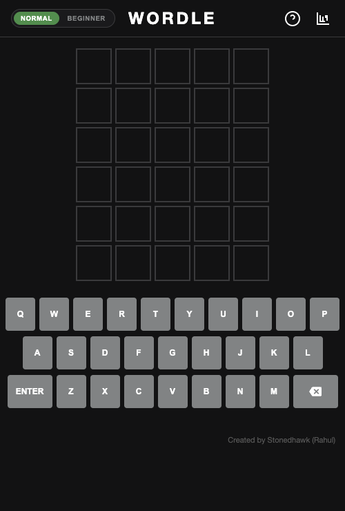

# Wordle Clone

A clean, browser-based Wordle clone with dark theme, smooth flip animations, and daily word tracking. No build step required - just open the file.

## How to Play

1. Guess the hidden 5-letter word in 6 tries.
2. Each guess must be a valid 5-letter word. Press **Enter** to submit.
3. The tiles change color after each guess to show how close you were:
   - **Green** - correct letter, correct position
   - **Yellow** - correct letter, wrong position
   - **Gray** - letter not in the word

A new word is available every day. Your progress resets at midnight.

## Features

- Daily word - same word for everyone each day, resets at midnight
- Smooth tile flip animations with color reveal at midpoint
- Stats tracking - games played, win percentage, streaks
- Guess distribution chart
- Streak system - current and max streak
- Share to clipboard - emoji grid for social sharing
- Duplicate letter handling (exact matches first, then yellows)
- Physical keyboard and on-screen QWERTY keyboard
- Game state persisted - refresh the page and resume where you left off
- How to Play modal with example tiles

## How to Run

Just open `index.html` in any modern browser. No server or build step needed.

## Live Demo

[https://stonedhawk.github.io/wordle-clone](https://stonedhawk.github.io/wordle-clone)

## Tech Stack

- React 18 (standalone CDN build)
- Babel standalone (JSX transpilation in-browser)
- HTML5 + CSS3 (animations, CSS Grid)
- Vanilla JavaScript
- localStorage for persistence

## License

MIT - see [LICENSE](LICENSE)
