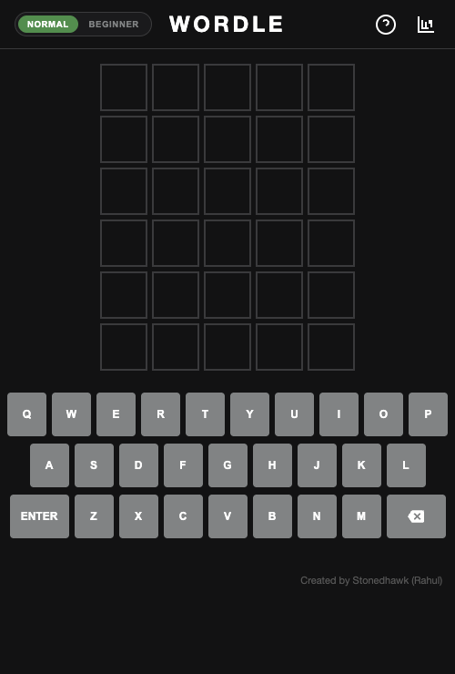

# 🎮 Wordle Clone

[](https://opensource.org/licenses/MIT)
[](https://react.dev/)
[](https://developer.mozilla.org/en-US/docs/Web/CSS)
[](https://github.com/stonedhawk/game-ready-dictionary)

A high-performance, modular browser-based **Wordle Clone** featuring smooth micro-animations, comprehensive streaks and stats tracking, a custom "Beginners" mode, and **O(m) trie-powered word validation**.

Built with a modern visual design, premium typography, and responsive grid layouts, this clone is designed to look stunning on both desktop and mobile devices.

🚀 **Zero Build Steps Required** - Just double-click the `index.html` file and start playing!

---

## 🎨 What We Built



- **⚡ Trie-Powered Validation**: Integrates a high-performance, pre-compiled Trie structure containing over **9,440 valid 5-letter guess words**, powered by the custom [game-ready-dictionary](https://github.com/stonedhawk/game-ready-dictionary) repository.
- **✨ Professional Answer Pool**: Daily word selection deterministic by day-of-year + year, carefully filtered to **1,066 common, clean, non-obscure words** to ensure an enjoyable and fair puzzle solving experience.
- **🛡️ Custom Game Modes**:
  - **Normal Mode**: The classic 6 guesses to find the daily word.
  - **Beginners Mode**: A relaxed, forgiving 10 guesses designed for casual players and children.
- **💫 Micro-Animations & Audio Cues**:
  - **Tile flip animations** with smooth 3D perspective rotations.
  - **Victory bounce animation** upon winning.
  - **Shake animations** and custom toasts on invalid guesses.
- **📊 Streaks & Guess Distribution**: Persistent local-storage stats tracker storing played games, win ratios, active streaks, and guess frequency charts, isolated per game-mode.
- **📋 Social Sharing**: Share your gaming achievements easily via a clipboard-copyable emoji-grid structure representing your color matches.
- **⌨️ Dual-Input Keyboard**: Color-coded on-screen QWERTY keyboard with physical keyboard listener integration.

---

## 🏗️ Technical Architecture

This clone represents a clean, modular, client-only architecture split to optimize maintainability, load speeds, and local playability.

```
wordle-clone/
├── index.html               # Main entry point (React UI & Game State)
├── LICENSE                  # MIT License
├── README.md                # Premium Documentation
├── CLAUDE.md                # Developer Guidelines
├── screenshot.png           # Visual Assets
└── src/
    ├── css/
    │   └── style.css        # Premium typography (Inter), glassmorphism, & animations
    └── js/
        ├── trie-engine.js   # TrieEngine class from @rahulmrx/game-ready-dictionary
        └── dictionary.js    # Precompiled 9.4k word trie and 1k answers list
```

---

## 📦 Dictionary Integration & Trie Performance

To deliver the absolute best UX, this game uses a highly optimized validation engine powered by the custom public utility [game-ready-dictionary](https://github.com/stonedhawk/game-ready-dictionary):

1. **Memory Efficient**: The dictionary containing **9,440 words** is pre-compiled into a nested Trie structure, compressed into a compact `179 KB` JavaScript file (`dictionary.js`).
2. **Sub-Microsecond Lookups**: Uses the `TrieEngine` class which yields **O(m)** complexity (where `m` is the word length of 5). Each dictionary lookup takes **~0.0001ms**, completely bypassing standard arrays and avoiding heavy string search loops.
3. **Smart Dialects & Filtering**: Sourced from industry-standard databases (**ENABLE1**, **12Dicts**, and **SCOWL**), pre-filtered to eliminate offensive language and brand trademarks.

Explore the dictionary engine here:
👉 **[stonedhawk/game-ready-dictionary](https://github.com/stonedhawk/game-ready-dictionary)**

---

## 🎮 How to Play

1. **Objective**: Find the hidden 5-letter word in **6 tries** (or **10 tries** in Beginner mode).
2. **Action**: Type a valid 5-letter word and press **Enter** to submit.
3. **Color Reveals**:
   - 🟩 **Green**: The letter is correct and in the correct spot.
   - 🟨 **Yellow**: The letter is in the word but in the wrong spot.
   - ⬛ **Gray**: The letter is not in the word.

A new puzzle is deterministically loaded every day at midnight!

---

## 🚀 How to Run Locally

Since this clone has **zero build steps** and zero external dependencies:

### Option A: Double-Click (Offline Play)
Simply open the `index.html` file in any modern web browser. It is configured to run fully offline using React and Babel Standalone via CDN links.

### Option B: Local Web Server
For development and network-enabled testing, run a quick local server:
```bash
# Node.js
npx serve .

# Python
python3 -m http.server 8000
```
Then navigate to `http://localhost:3000` or `http://localhost:8000` in your browser.

---

## 🛠️ Tech Stack

- **Framework**: React 18 (standalone CDN build)
- **Transpiler**: Babel standalone (JSX transpilation in-browser)
- **Styling**: Vanilla CSS3 + Google Fonts Inter (Responsive grid systems, flexbox)
- **Validation Engine**: TrieEngine (O(m) pre-compiled trie query utility)
- **Persistence**: Web `localStorage` API for state and stats caching

---

## 📄 License

This project is licensed under the MIT License - see the [LICENSE](LICENSE) file for details.
All dictionary data is sourced from public domains and licensed under UNLICENSE.

---

Designed with ❤️ by **Stonedhawk (Rahul Shah)**. Star this repository if you enjoy playing!
